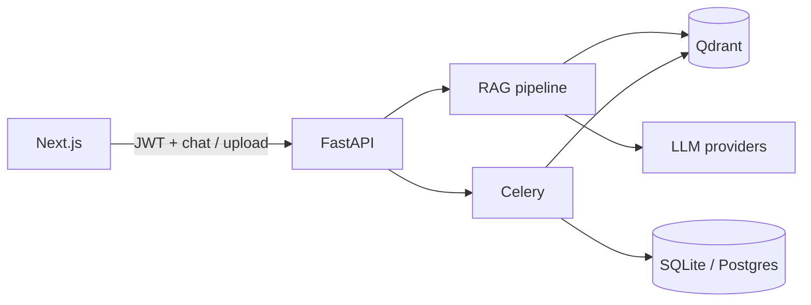

# PersonalAIAssist

Personal RAG assistant: upload PDFs, Word docs, CSVs, and images, then chat with them and get answers with source citations.

**Stack:** Next.js · FastAPI · Qdrant · Celery/Redis · multi-provider LLMs (OpenAI, Anthropic, Gemini, OpenRouter, Cursor)

## Features

- Document upload and async indexing (parse → chunk → embed)
- Scoped chat across one, many, or all of your documents
- Streaming answers (SSE) with citation badges and a Sources panel
- Multi-tenant isolation (per-user retrieval and storage)
- JWT auth and optional Google OAuth
- Local embeddings by default (Nomic Embed Text); optional cloud embedders / Cohere rerank

## Quick start

### Prerequisites

- Python 3.11+
- Node.js 20+
- Docker & Docker Compose

### 1. Clone and configure

```bash
git clone https://github.com/ramakanthboga/PersonalAIAssist.git
cd PersonalAIAssist
cp .env.example .env
cp backend/.env.example backend/.env
```

Windows (PowerShell):

```powershell
Copy-Item .env.example .env
Copy-Item backend\.env.example backend\.env
# Generate a SECRET_KEY:
python -c "import secrets; print(secrets.token_hex(32))"
```

Set at least `SECRET_KEY` and one LLM API key. Never commit `.env` files (see `.gitignore`).

The backend can read the root `.env` (Docker) and `backend/.env` (local dev).

### 2. Start infrastructure (Qdrant + Redis)

```bash
make infra
```

```powershell
.\make.ps1 infra
```

### 3. Backend

```bash
cd backend
python -m venv .venv
source .venv/bin/activate   # Windows: .venv\Scripts\activate
pip install -r requirements.txt
alembic upgrade head
uvicorn app.main:app --reload --port 8000
```

### 4. Frontend

```bash
cd frontend
npm install
npm run dev
```

### 5. Or run everything with Docker

```bash
make up
# Windows: .\make.ps1 up
```

| Service | URL |
|---------|-----|
| Frontend | http://localhost:3000 |
| API | http://localhost:8000 |
| OpenAPI docs | http://localhost:8000/docs |

## Architecture (overview)



| Layer | Technology |
|-------|-----------|
| Frontend | Next.js 16, React 18, TailwindCSS |
| Backend | FastAPI, SQLAlchemy 2, Alembic |
| Vector DB | Qdrant |
| Queue | Celery + Redis |
| Embeddings | Nomic Embed Text v1.5 (default) |

**Deeper design** (sequence diagrams, RAG flow, citations, chat API shape): [docs/ARCHITECTURE.md](docs/ARCHITECTURE.md)

## Project structure

```
PersonalAIAssist/
├── backend/          # FastAPI, RAG, ingestion, Celery
├── frontend/         # Next.js app
├── docs/             # Architecture and design notes
├── docker-compose.yml
├── Makefile / make.ps1
└── .env.example
```

## Make commands

On Linux/macOS: `make <command>`. On Windows: `.\make.ps1 <command>`.

| Command | Description |
|---------|-------------|
| `up` | Start all services (Docker Compose) |
| `down` | Stop all services |
| `infra` | Start Qdrant + Redis only |
| `backend` / `frontend` / `worker` | Local dev processes |
| `migrate` | Run Alembic migrations |
| `test` / `test-cov` | Backend tests |
| `clean` | Remove caches, artifacts, volumes |

## Security

Before using or publishing:

- Keep the repository private until you confirm no secrets are in git history
- Use strong `SECRET_KEY` values; store API keys only in `.env` (never in source)
- Prefer enabling GitHub **secret scanning**, **push protection**, and **Dependabot**

Application controls include JWT (+ optional Google OAuth), bcrypt passwords, upload validation, rate limiting, input sanitization, and per-user data isolation.

### Google OAuth (optional)

1. Create an OAuth Web client in Google Cloud Console.
2. Redirect URI: `http://localhost:8000/api/v1/auth/google/callback`
3. Set `GOOGLE_CLIENT_ID` and `GOOGLE_CLIENT_SECRET` in `.env` (see `.env.example`).
4. Run `alembic upgrade head` and restart the backend.

## Troubleshooting

**Docker build fails / disk full / CUDA downloads**  
Backend Docker builds use `requirements-docker.txt` with the PyTorch CPU index. Prune cache (`docker system prune -a`), raise Docker Desktop disk/RAM, then `.\make.ps1 up`.

**`500` / `EOF` / `containerd.sock` during build**  
Restart Docker Desktop, prune, rebuild. Prefer `.\make.ps1 up` so the worker reuses the backend image. If images already exist: `.\make.ps1 start`.

## Contributing

Issues and pull requests are welcome once the repo is public. Keep secrets out of commits; run `make test` (or `.\make.ps1 test`) before opening a PR.

## License

No `LICENSE` file is included yet. Add an OSI license (for example MIT or Apache-2.0) before making the repository public if you want others to use or contribute under clear terms. Until then, default copyright applies.
