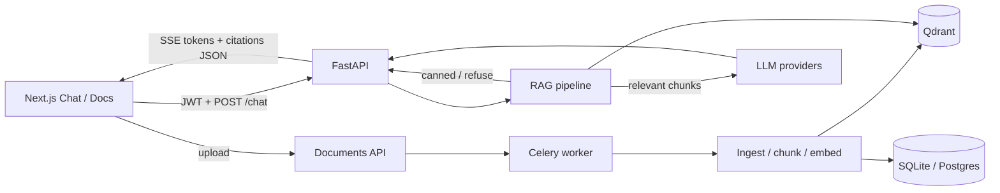
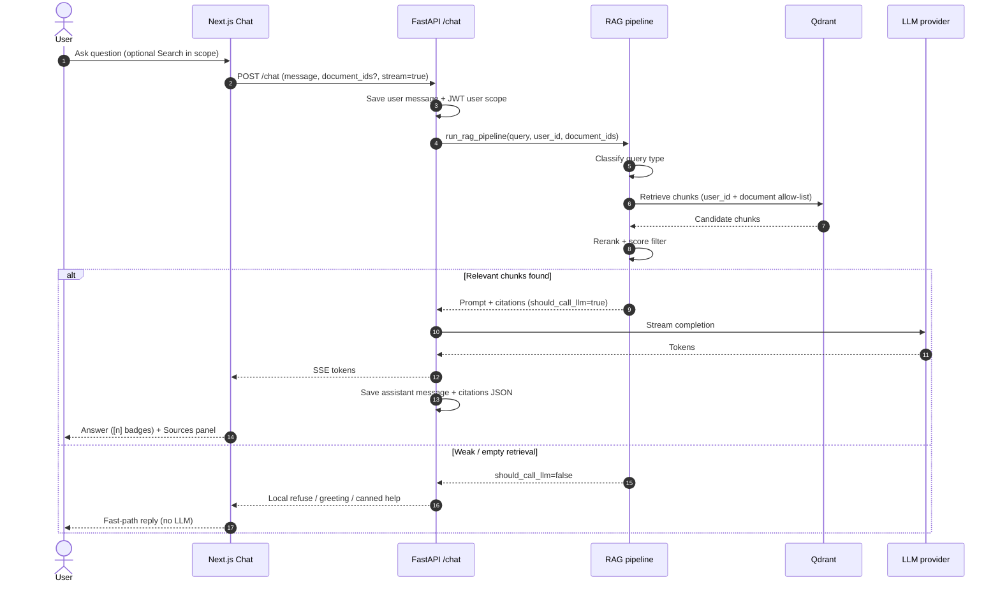
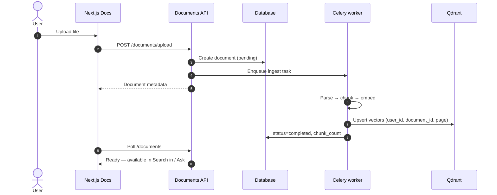
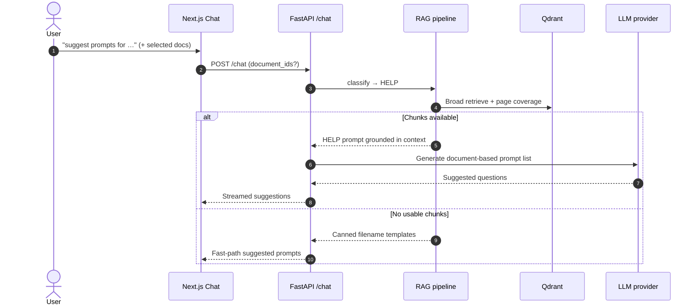

# Architecture

Detailed design notes for PersonalAIAssist. For a short overview, see the root [README](../README.md).

## Stack

| Layer | Technology |
|-------|-----------|
| **Frontend** | Next.js 16, React 18, TailwindCSS, IBM Plex Sans, react-markdown (GFM) |
| **Backend** | Python 3.11+, FastAPI, Pydantic v2, SQLAlchemy 2.0 |
| **LLM** | Multi-provider (OpenAI, Anthropic, Gemini, Cursor SDK, OpenRouter) |
| **Vector DB** | Qdrant (dense retrieval; payload filters by `user_id` / `document_id`) |
| **Embeddings** | Nomic Embed Text v1.5 (default local), optional cloud embedders |
| **Reranker** | Cohere Rerank v3 (when configured) |
| **Task Queue** | Celery + Redis (document ingestion) |
| **Database** | SQLite (dev) / PostgreSQL (prod) via Alembic migrations |
| **Observability** | Langfuse tracing, structlog |

## System overview

## Sequence: chat with documents

## Sequence: document upload and indexing

## Sequence: HELP (“suggest prompts”)

## Chat / RAG flow

1. **Auth** — JWT; every retrieval and DB query is scoped to the current user.
2. **Document scope** — optional allow-list on each chat request:
   - `document_ids`: one or more completed document IDs (multi-select in UI)
   - `document_id`: single-document / legacy field (merged into the same allow-list)
   - neither → search **all** of the user’s completed documents
3. **Classify** — query type (`lookup`, `synthesis`, `comparison`, `listing`, `help`, `general`) tunes retrieval depth and instructions.
4. **Retrieve → rerank → filter** — Qdrant search within the allow-list; low-relevance chunks are dropped. Weak/empty context sets `should_call_llm=False` so the API refuses or uses a local fast path (no general-knowledge answers).
5. **HELP (“suggest prompts”)** — with documents, retrieve broad context and call the LLM for **document-grounded** prompt suggestions. Filename-based canned templates are only a fallback when retrieval finds nothing.
6. **Answer** — LLM streams via SSE when context is strong enough; citations metadata is stored on the assistant message as JSON.

## Citations

| Layer | Behavior |
|-------|----------|
| **Prompt** | Model cites with compact markers `[1]`, `[2]` matching context source numbers. Filenames and page numbers must **not** appear in the answer body. |
| **UI body** | `MarkdownContent` renders markdown, strips legacy verbose `(Source: …, Page N)` text, and styles `[n]` as small badges. |
| **Sources panel** | `CitationCard` groups chunks by document, shows page lists (`pp. …`), and hover previews — the place for full provenance. |

## Document scope UI

- **Search in** (`DocumentScopeSelector`) — searchable multi-select above the composer; empty selection = all documents; selection is remembered in `sessionStorage` for the browser session.
- **Docs → Ask** — starts a new chat scoped to that file.
- Suggestion chips adapt to single-doc, multi-doc, or all-docs scope.

## Chat API request shape

`POST /api/v1/chat/` body (selected fields):

| Field | Purpose |
|-------|---------|
| `message` | User question |
| `conversation_id` | Continue an existing thread (optional) |
| `document_id` | Optional single-document filter |
| `document_ids` | Optional multi-document filter |
| `stream` | SSE streaming (default `true`) |
| `provider` / `model` | Optional LLM overrides |

Interactive OpenAPI docs are available at `/docs` when the backend is running.

## Key frontend chat pieces

| Component | Role |
|-----------|------|
| `ChatWindow` | Messages, composer, scope wiring, scoped suggestions |
| `DocumentScopeSelector` | Multi-document search allow-list |
| `MarkdownContent` | Readable markdown + citation cleanup |
| `CitationCard` | Grouped Sources panel |
| `StreamingMessage` | Live token stream display |
